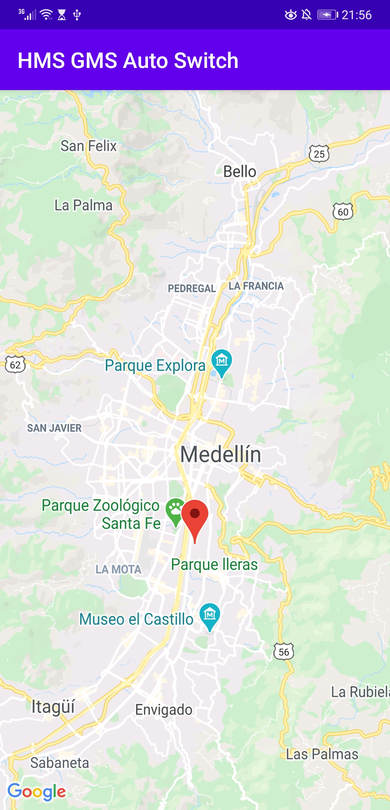
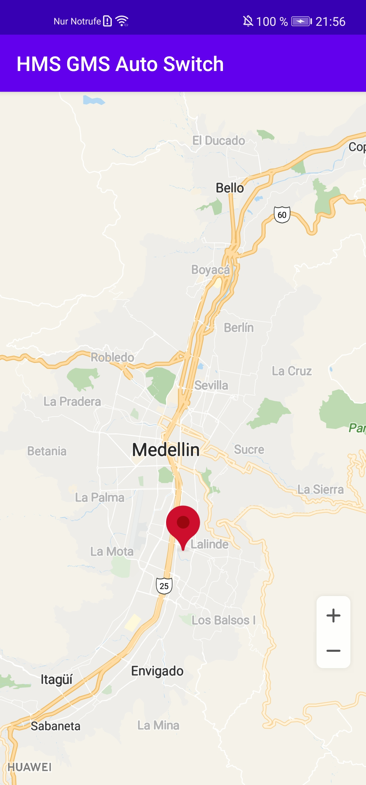
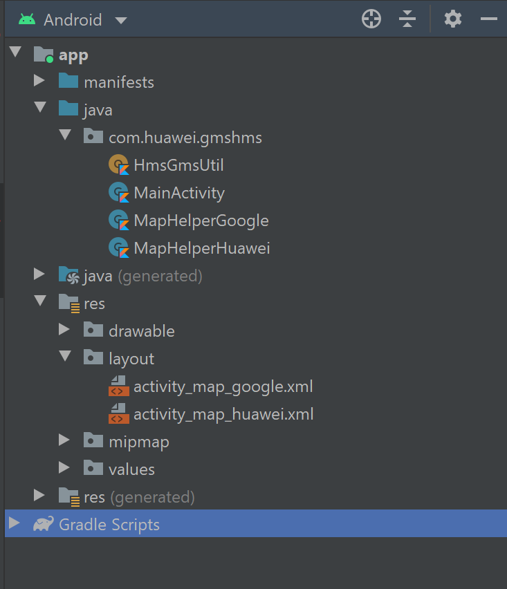

<h1 align="center">Welcome to HMS/GMS Auto Switcher 👋</h1>

  

<ul>
  <li>HMS stands for Huawei Mobile Services</li>
  <li>GMS stands for Google Mobile Services</li>
</ul>

Automatically Switch between HMS or GMS Map based on phone via IF/ELSE (Kotlin)

https://medium.com/@heydjbaby/hms-gms-auto-switcher-with-if-else-full-source-code-available-below-fd27798a1a2f

|||
|:---:|:---:|
| Huawei P20 Pro (GMS+HMS) | Huawei P40 Lite (HMS Only) |

## Classes and Resources needed

## Author

👤 **Hunter**

* Github: [@hunterxxx](https://github.com/hunterxxx)
* LinkedIn: [@https:\/\/www.linkedin.com\/in\/hunterfoo\/](https:\/\/www.linkedin.com\/in\/hunterfoo\/)

## Show your support

Give a ⭐️ if this project helped you!

## 📝 License

Copyright © 2020 [Hunter](https://github.com/hunterxxx). 
This project is [Apache License, Version 2.0 (the &#34;License&#34;)](http://www.apache.org/licenses/LICENSE-2.0) licensed.

